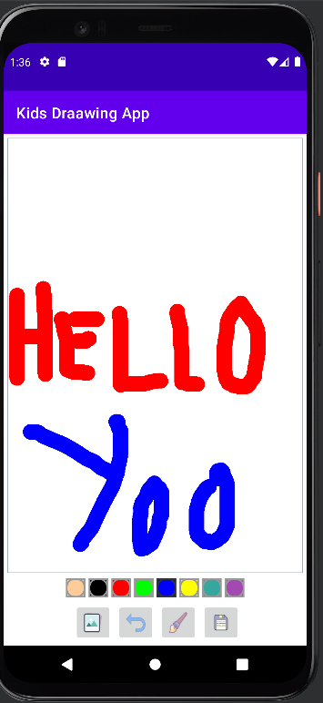

# KidsDrawingApp

--> Landing Page

-> Here you can choose  color nd drw anything you like.

-> You can also change the size of your brush depending on your need.

-> It also has a image chooser from which you can choose and image and draw on top of it.

-> Oops!!, made a mistake while drawing worry not you can undo your steps.

-> Now after completing the image, You can save your master-piece in your device.

# Example

